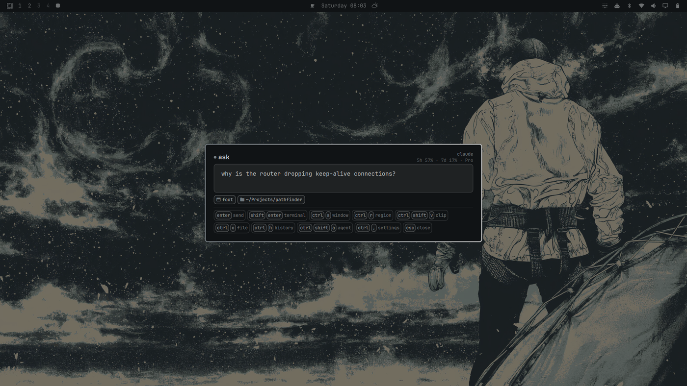
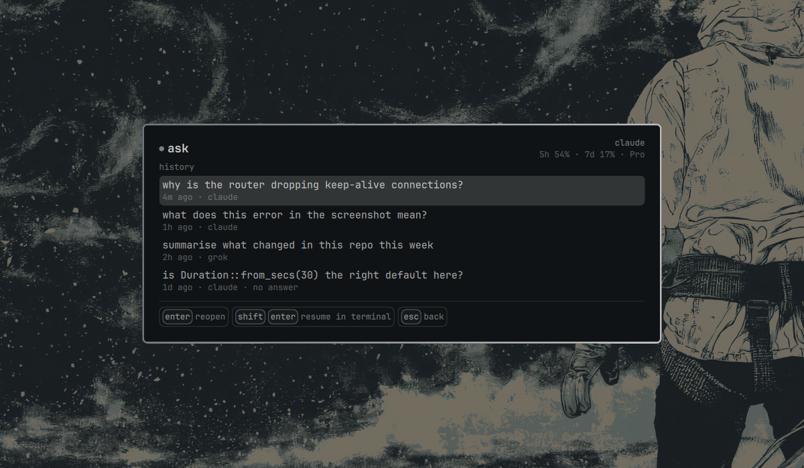
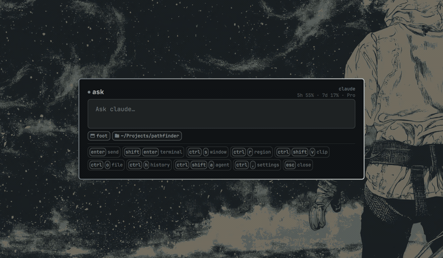
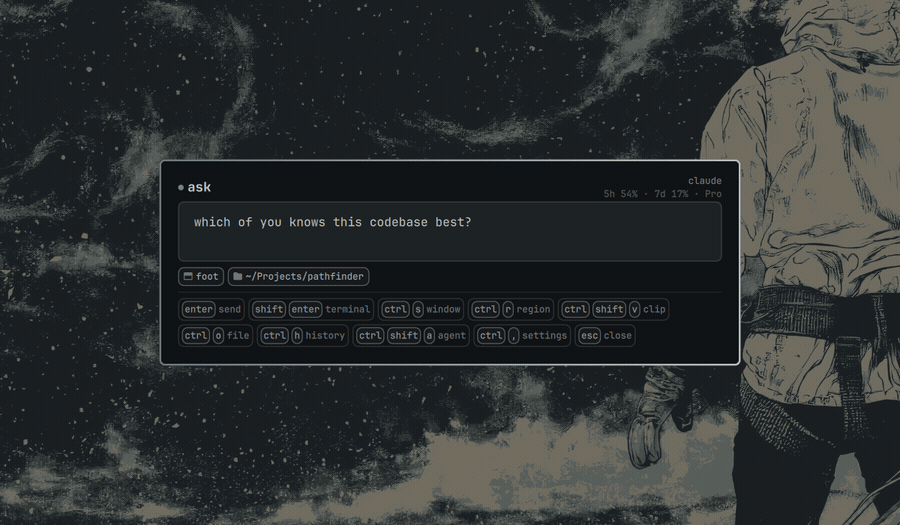
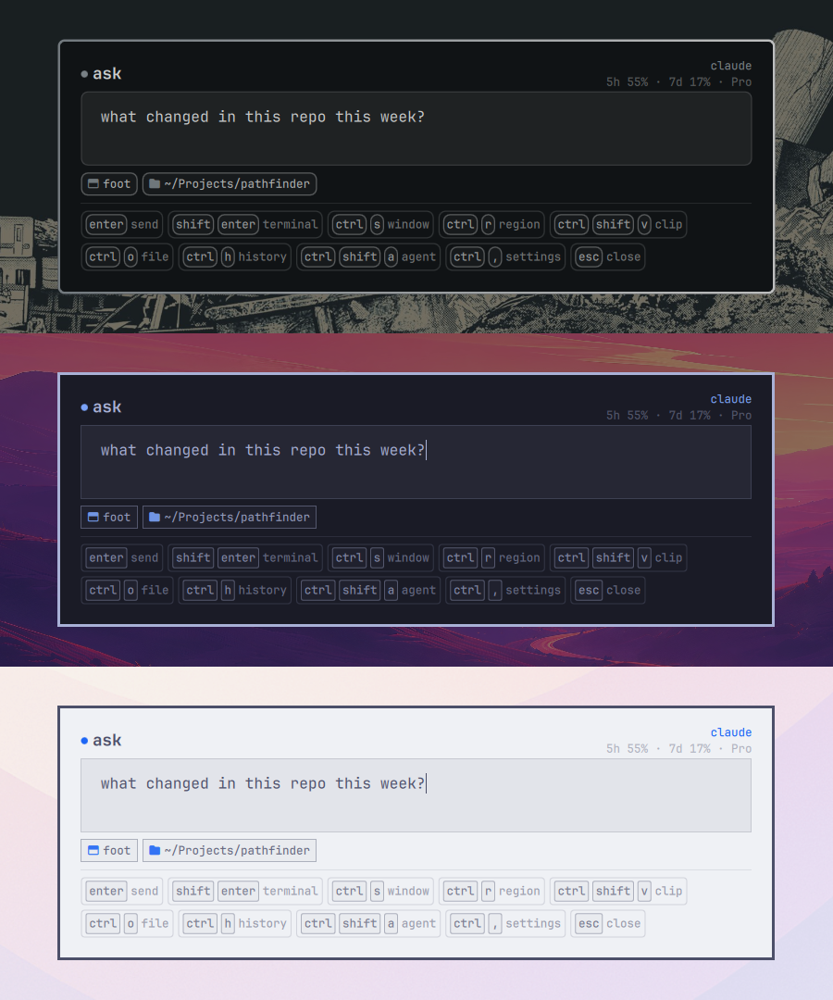
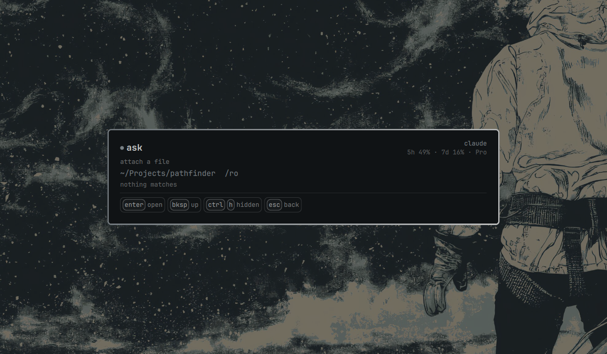
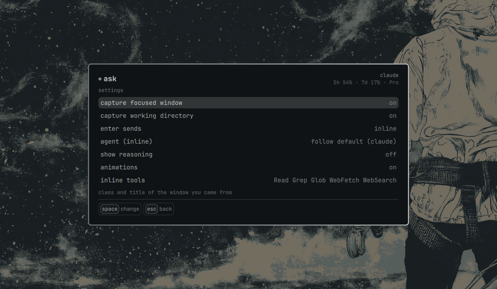

# Ask Anywhere

**Ask your coding agent anything, from anywhere, without losing what you were doing.**

`SUPER+Q` opens a card over whatever is on screen. Type a question. It goes to
your default Omarchy agent — with the window you were looking at, the directory
you were in, and anything you chose to attach — and the answer streams back in
place.


*Typed, sent, answered in place. Recorded on a stock Omarchy desktop; the pauses
where nothing moves are collapsed, nothing else is.*

---

## Install

```bash
omarchy plugin add https://github.com/Xn4m3d/omarchy-ask.git --enable --yes
ln -sf ~/.config/omarchy/plugins/xn4m3d.ask/bin/omarchy-ask* ~/.local/bin/
```

Then one line in `~/.config/hypr/bindings.lua`:

```lua
o.bind("SUPER + Q", "Ask agent", "omarchy-ask")
```

That is the whole installation. **No package to install, no service to enable,
no API key to paste.**

## Remove

```bash
omarchy plugin remove xn4m3d.ask
rm -f ~/.local/bin/omarchy-ask*
```

Then delete the `SUPER + Q` line from `~/.config/hypr/bindings.lua`.

Nothing else of yours is touched by the install, so nothing else needs undoing.
Two files are written the first time you use the card, and they outlive an
uninstall on purpose — delete them if you want the machine clean:

```bash
rm -f  ~/.config/omarchy/ask.json                    # settings
rm -rf ~/.local/state/omarchy/ask                    # prompt and answer history
```

Attachments live in `$XDG_RUNTIME_DIR`, so they are gone at the next reboot
whatever you do.

## Why there is nothing to set up

On Omarchy every moving part this needs is already running. `ask` is glue, not
a stack:

| What it needs | Already on your machine |
|---|---|
| A QML host that is already warm | `quickshell` — a direct dependency of `omarchy` |
| Routing a prompt to *your* agent | `omarchy-agent`, `omarchy default agent` |
| A frozen-screen region picker | `omarchy-capture-region` — the same UX as `SUPER+SHIFT+S` |
| Screenshots and clipboard | `grim`, `slurp`, `wl-clipboard` — all in `omarchy-base.packages` |
| Rate-limit numbers | `omarchy-agent-usage-update`, whose records the bar widget already draws |
| Desktop notifications | `omarchy-notification-send` |
| JSON on the shell side | `jq` — a direct dependency of `omarchy` |
| Theme, spacing, type | the shell's own `qs.Commons` singletons |
| Install and update | `omarchy plugin add` / `update` |

What `ask` adds is **~2,700 lines of QML and three bash helpers**. It never
talks to a model API itself — it drives the agent CLI you already signed in to.

Because it leans on `omarchy-agent`, it works with **every agent Omarchy
supports** (claude, codex, grok, gemini, copilot, opencode, crush, pi).
Streaming the answer *inside the card* needs a per-agent adapter; everything
else falls back to a terminal, which is generic by construction — see
[Agent support](#agent-support).

## What it does



**It brings the context with it.** The class and title of the window you came
from, and — for a terminal — the working directory, resolved from the shell
running inside it. The agent starts *in* that directory, so "why is this
failing?" is a question about your project rather than about nothing.

**It attaches what you point at.** `ctrl+s` shoots the window you came from,
`ctrl+r` picks a screen region through Omarchy's own frozen-screen picker,
`ctrl+shift+v` takes the clipboard (image or text), `ctrl+o` opens a
keyboard-driven file picker. Each becomes a removable chip and travels to the
agent **as a file path** — so it works identically for every agent, with no
upload protocol anywhere.

Nothing is attached without a keystroke. A clipboard that shipped with every
question would eventually ship a password.

**It answers in place, or hands off.** `enter` streams the answer into the card
as rendered markdown. `shift+enter` sends the same question to a real agent
terminal instead. The inline path is **read-only** — a global hotkey that can
auto-approve writes from anywhere is not a trade worth making — so anything that
changes files belongs in the terminal, where approvals are in front of you.

**It never loses an answer.** Closing the card does not cancel the agent. The
turn keeps running, the answer is recorded, and a notification brings you back
to it. `ctrl+c` stops a run when that is what you actually mean.



**It remembers.** `↑` recalls previous prompts, shell-style. `ctrl+h` opens
every past turn — each carrying the agent's **session id**, so reopening one
continues that conversation instead of re-asking it, and `shift+enter` resumes
it in a terminal through the agent's own `--resume`. That also works without
opening history: once an answer is on screen, `shift+enter` on an empty box
takes *that* conversation to a terminal, which is what "keep going, but where I
can approve things" looks like in one keystroke.

**It says what it is doing.** Which model answered, how much of your rate limit
is gone, and — folded away until you want it — the agent's reasoning.



**It says things once.** The context block and the attachment paths go out on
the first turn of a session and not again. A follow-up resumes that session, so
repeating them would spend tokens restating what the agent already has — and
repeating *"read the attached files"* would make it re-read a screenshot on
every single turn. Attach something new mid-conversation and only that is
announced. The terminal path still sends everything, because `shift+enter`
starts an agent that has been told nothing.



**It switches agents mid-thought.** `ctrl+shift+a` — or a click on the agent's
name — moves to the next agent that is *installed on this machine* **and** that
ask can stream from. Installation is asked of `mise`, the same way Omarchy asks
before offering to install one. No menu of agents you do not have, and none it
would only pretend to use. The choice is the plugin's own: `omarchy default
agent` keeps whatever the rest of your desktop was told to use.



Nothing in the card names a colour. It is built out of the shell's own `[menu]`
surface tokens, which are file-watched — so setting an Omarchy theme restyles an
open card, without restarting anything.



## Keys

| Key | Does |
|---|---|
| `SUPER+Q` | open / close |
| `enter` | send — streams the answer here (or follow up, once there is one) |
| `shift+enter` | send to a terminal agent instead — with the box empty, continue the answer on screen there |
| `ctrl+enter` | newline |
| `↑` `↓` | recall previous prompts, from the first/last line of the box |
| `ctrl+s` | attach a shot of the window you came from |
| `ctrl+r` | attach a screen region |
| `ctrl+shift+v` | attach the clipboard (image or text) |
| `ctrl+o` | attach a file — opens the picker |
| `ctrl+shift+backspace` | drop the last attachment |
| `ctrl+shift+c` | copy the answer (a `copy` button sits beside the question too) |
| `ctrl+t` | fold the agent's reasoning open or shut |
| `ctrl+h` | history |
| `ctrl+shift+a` | switch to the next installed agent |
| `ctrl+,` | settings |
| `ctrl+c` | stop a running answer |
| `esc` | close — the agent keeps running |

## Agent support

| Agent | Inline streaming | Notes |
|---|---|---|
| `claude` | yes | verified end to end against Claude Code's `stream-json` |
| `grok` | yes | verified end to end against Grok 4.6: deltas, session id, tool calls |
| everything else | no — terminal | via `omarchy-agent --prompt`, which works for all of them |

The switch offers only agents that are installed **and** streamable. `mise`
decides what counts as installed — a binary on `PATH` is not enough to go on,
because mise keeps a shim there for every tool it knows about, installed or
not, so a naive check would offer you agents that open an install prompt the
first time you asked them anything. Streamable, because `ctrl+shift+a` is about
who answers *in the card*; an agent with no adapter has nothing to stream.

An agent picked here is the agent that answers, on **both** paths. That is less
obvious than it sounds. `omarchy-agent` takes no agent argument: it reads
`omarchy default agent` and then builds that agent's own spelling of "don't
stop to ask" — `claude --permission-mode auto`, `grok --permission-mode
bypassPermissions`, `codex --approve-for-me`, and six more. So the card used to
name one agent while the terminal launched another.

Copying that table into the plugin would mean keeping a private fork of
Omarchy's launch policy and being silently wrong the day upstream changes a
flag. [`bin/omarchy-ask-terminal`](bin/omarchy-ask-terminal) overrides the agent
at the one place it is read instead: a shim at the head of `PATH` answers the
`omarchy-default-agent` call `omarchy-agent` makes, and the flags, the app-id
and the terminal all stay Omarchy's. If a future Omarchy stops resolving its
agent that way the shim would quietly become a no-op, so the assumption is
checked before launch and says so instead of running the wrong agent.

Adding an agent is two pure functions in [`agents.js`](agents.js): `argv(opts)`
and `parse(line)`. An unrecognised line returns `null` and is ignored — these
formats gain event types over time, and an unknown line must never be fatal.

## Settings — `ctrl+,`



Space changes the selected value; booleans flip, enums advance.

| Setting | Default | What it does |
|---|---|---|
| `captureWindow` | `true` | attach class and title of the window you came from |
| `captureCwd` | `true` | resolve the terminal's directory and run the agent in it |
| `sendMode` | `inline` | what plain `enter` does |
| `agent` | `""` | force an agent for the inline path; empty follows `omarchy default agent`. Lists what is installed and streamable |
| `reasoningTokens` | `0` | thinking budget for the inline run; `0` disables it |
| `animations` | `true` | entrance, activity pulse, streaming cursor |
| `inlineTools` | `Read Grep Glob WebFetch WebSearch` | tools the inline run may use |

They live in `~/.config/omarchy/ask.json`, deliberately **outside** this
checkout: `omarchy plugin update` fast-forwards the plugin directory and would
walk over a config file kept inside it. Only changed keys are written.

## Tested, and not

Built and exercised on a single machine. Being straight about which is which:

**Verified by running it**

- Summon → type → send → answer, on Claude **and on Grok**, repeatedly.
- Switching agents with `ctrl+shift+a`, and the session id being dropped on the
  way across so the next question does not ask one agent to resume another's
  conversation.
- A forced agent that cannot stream is named as such in the header rather than
  silently answered by a different one.
- The agent really starts in the captured directory (checked through `/proc/<pid>/cwd`).
- Attachments: window shot, region, clipboard text, file picker — files land,
  chips appear, paths reach the prompt.
- A window screenshot contains the window and **not** the ask card. This took a
  fix: `grim` fired before the compositor had dropped our surface, and baked a
  ghost of the card into the image.
- Closing mid-run leaves the agent running and the answer recorded.
- Follow-ups reuse the session id — the answer stays on topic when the question
  no longer names the topic.
- A follow-up carries the question alone. Read back out of Claude Code's own
  session transcript: turn one holds the context block and the attachment,
  turn two holds four words.
- `ctrl+shift+c` really puts the answer on the clipboard.
- Live theme switching restyles the open card (Solitude → Catppuccin → Gruvbox).
- Empty history, empty directory, unreadable directory, and filenames with
  spaces, accents and apostrophes.
- Prompt quoting against `$VAR`, backticks, `$(…)` and apostrophes.
- The adapter parser, unit-tested on real lines including malformed JSON.

- A run that cannot start — an agent whose working directory no longer exists —
  ends in a stated error rather than a card that waits forever.

**Written but not observed**

- **The `copy` button's click.** The shortcut is verified and the button calls
  the same function, but there is no synthetic-mouse tool here — no click has
  ever been sent to this card. It is the only untested *click* in the whole UI.
- **The reasoning panel, end to end.** The parser is unit-tested, and
  `MAX_THINKING_TOKENS` does produce `thinking_delta` from the CLI, but every
  run through the UI answered without a reasoning block — so the rendered panel
  has not been seen.

**Out of scope for now**

- Non-Hyprland compositors: context collection is `hyprctl`, by design.
- Multi-monitor, and scale factors other than the one it was built on.
- Codex: `codex exec --json` speaks its own event format and has no adapter yet.

## Contributing

**Pull requests are very welcome** — `ask` is still in development, and the
point of it is to be useful to people who actually run it. Anything you send is
read, considered on its merits, and merged when it fits; if it does not fit as
sent, expect a real answer about why rather than silence.

The gaps listed just above are the obvious way in, and each is self-contained:

- **A `codex` adapter.** `codex exec --json` has its own event format. Two pure
  functions in [`agents.js`](agents.js) and it streams inline like Claude.
- **Confirm — or fix — the `grok` adapter.** It is written against the
  documented envelope but has never run, so anyone with a signed-in xAI CLI can
  settle it in one turn.
- **Any other agent** Omarchy supports. Same two functions.
- **Multi-monitor and other scale factors.** Built on a single 1080p screen; if
  the card sits wrong on your setup, a bug report with `hyprctl monitors` is
  already useful.
- **Themes.** Every color comes from the shell's tokens, so if some theme makes
  the card unreadable that is a real bug worth reporting.

Requests are welcome too, not just patches. If it does something awkward on
your machine, say so — awkward-on-a-real-desktop beats correct-in-principle.

Two things to know before hacking:

- A third-party plugin runs **unsandboxed inside `omarchy-shell`**, so a change
  that throws can take the bar down with it. Keep
  `omarchy plugin disable xn4m3d.ask && omarchy restart shell` within reach.
- Please say in the PR what you actually ran. This project keeps a
  [Tested, and not](#tested-and-not) section precisely so nobody has to guess
  what has been exercised and what has only been written.

## How it works

The overlay lives inside the already-running `omarchy-shell` Quickshell process,
so summoning it is an IPC call into something warm rather than a cold start.

```
SUPER+Q → omarchy-ask → omarchy-shell shell toggle xn4m3d.ask '<payload>'
                                            └→ Ask.qml open(payload)
```

**Context is collected by the wrapper, before the IPC call.** That is the one
structural constraint: as soon as the layer-shell card takes keyboard focus,
`hyprctl activewindow` no longer describes what you were looking at. So
`bin/omarchy-ask` gathers the facts first and hands them over as JSON — which
also makes the whole thing drivable from a shell, with no keyboard involved.

A few decisions worth knowing about:

- **The cwd comes from the window pid's first child**, not from walking the
  process tree to its deepest leaf: that lands on short-lived processes whose
  `/proc` entry is often already gone.
- **Listing uses `find -printf`, not `ls -1`** — a filename containing a newline
  makes `ls` output unparseable, and unparseable here means attaching the wrong
  file.
- **Screenshots wait for the compositor** to commit a frame without our surface,
  and animations are force-disabled during a capture.
- **The screensaver and lock surfaces are filtered out** of the window context:
  no context beats confidently wrong context.
- **Motion matches Omarchy** — 140 ms / OutCubic, the duration the shell uses
  most — with no blur and no extra rounding, because Omarchy ships both off.

## Hacking on it

A plugin is a plain git checkout in `~/.config/omarchy/plugins/<id>/`, so clone
it there and edit in place.

Saving a file under that directory triggers a plugin reload, but **an overlay
with `keepLoaded: true` keeps its mounted instance**, so UI edits do not always
appear. When a change seems not to apply:

```bash
omarchy restart shell
```

Third-party plugins run unsandboxed inside `omarchy-shell`. The way back from a
bad change:

```bash
omarchy plugin disable xn4m3d.ask && omarchy restart shell
```

Useful while iterating:

```bash
# the context, without opening anything
omarchy-ask --print-context

# drive the card by hand, with a made-up context
omarchy-shell shell summon xn4m3d.ask '{"window":{"class":"foot"},"cwd":"/tmp"}'
omarchy-shell shell hide xn4m3d.ask

# QML warnings land in the journal
journalctl --user _PID=$(pgrep -f 'quickshell -n -p /usr/share/omarchy/shell') -f
```

Built against **Omarchy 4.0.2** / **Hyprland 0.56.2**.

## License

MIT — see [LICENSE](LICENSE).

No dependency to declare: everything the plugin calls is already part of an
Omarchy install (`hyprctl`, `grim`, `slurp`, `wl-clipboard`, `jq`,
`omarchy-agent`, `omarchy-launch-tui`, `omarchy-notification-send`). The agents
themselves are yours, installed and authenticated by `omarchy default agent`,
and the plugin never ships or bundles one.
